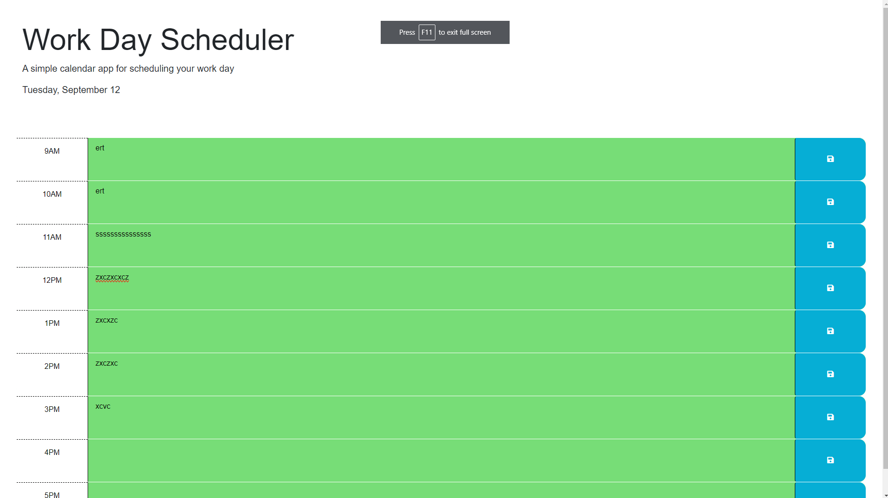

# Challenge 5: Work Day Scheduler

## Description

This project is a webpage that is displaying a work day scheduler. It was a project built using a third party api, localStorage, data attributes, and other important fundamentals of a website.
The webpage features a dynamic date in the header, dynamic coloring of each section depending on the time of day, and storing the text locally when clicking the save button for each section.

This project was pretty fair given that the starter code gave most of the html. Nonetheless, it was a good learning experience regarding the basics of localStorage and navigating DOM elements.

## Installation

To install the project, clone the repository onto your PC.
Enter the directory that has the cloned repository and open (Double click) the index.html, style.css and script.js files to read the code and access the files.

To access the webpage, click the link below:

https://phipham0.github.io/challenge-5-scheduler/

## Usage

Right off the bat there is a title and header describing the functionality of the daily calendar. The date in the header is dynamic and will change according to the today's date. There are
hourly sections that can be typed in when clicked. The user can type in any text and click the floppy disc/save icon to store that text into the local storage, allowing the text to persist, 
even after refreshing. The sections are also color coded based on the time of day. Grey represents the past, red is the present, and green is the future.

## Credits

Credit to Instructor Hubert's review session and office hours. It allowed me to get through roadblocks regarding CORS and javscript.

## License

MIT License

Copyright (c) [year] [fullname]

Permission is hereby granted, free of charge, to any person obtaining a copy
of this software and associated documentation files (the "Software"), to deal
in the Software without restriction, including without limitation the rights
to use, copy, modify, merge, publish, distribute, sublicense, and/or sell
copies of the Software, and to permit persons to whom the Software is
furnished to do so, subject to the following conditions:

The above copyright notice and this permission notice shall be included in all
copies or substantial portions of the Software.

THE SOFTWARE IS PROVIDED "AS IS", WITHOUT WARRANTY OF ANY KIND, EXPRESS OR
IMPLIED, INCLUDING BUT NOT LIMITED TO THE WARRANTIES OF MERCHANTABILITY,
FITNESS FOR A PARTICULAR PURPOSE AND NONINFRINGEMENT. IN NO EVENT SHALL THE
AUTHORS OR COPYRIGHT HOLDERS BE LIABLE FOR ANY CLAIM, DAMAGES OR OTHER
LIABILITY, WHETHER IN AN ACTION OF CONTRACT, TORT OR OTHERWISE, ARISING FROM,
OUT OF OR IN CONNECTION WITH THE SOFTWARE OR THE USE OR OTHER DEALINGS IN THE
SOFTWARE.
